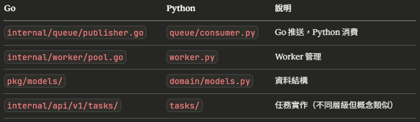

## Python-worker file structure
```
python-worker/
├── main.py                          # 入口點
├── pyproject.toml
├── uv.lock
│
├── src/
│   ├── __init__.py
│   │
│   ├── domain/
│   │   └── models.py                # TaskMessage, TaskExecution
│   │
│   ├── queue/                       # ⭐ 新增：Queue 層
│   │   ├── __init__.py
│   │   ├── consumer.py              # 從 Redis 取任務
│   │   └── status_updater.py       # 更新任務狀態（可選）
│   │
│   ├── tasks/                       # ⭐ 任務定義與註冊
│   │   ├── __init__.py
│   │   ├── registry.py              # 註冊所有 task handler
│   │   ├── email_task.py            # send_email 的實作
│   │   └── data_task.py             # process_data 的實作
│   │
│   ├── handlers/                    # ⭐ 通用處理邏輯
│   │   ├── __init__.py
│   │   ├── executor.py              # 執行任務（重試、錯誤處理）
│   │   └── idempotency.py           # 冪等性檢查
│   │
│   ├── utils/
│   │   ├── __init__.py
│   │   ├── redis_client.py          # Redis 連線
│   │   └── logger.py                # 日誌（可選）
│   │
│   └── worker.py                    # Worker 主邏輯
```

## 各資料夾的職責
### 1. domain/models.py ✅
* 定義資料結構
```
- python- TaskMessage（對應 Go 的輕量結構）
- TaskExecution（Python 執行時使用）
```

### 2. queue/ ⭐ 新增
* 與 Redis Queue 互動
```
queue/consumer.py
```
```
職責：
- 從 Redis 取出任務（RPOP 或 XREADGROUP）
- 解析 JSON 成 TaskMessage
- 提供 consume() 方法給 worker 呼叫

不做：
- 不處理業務邏輯
- 不處理重試
- 只負責「取」和「解析」
```
```
queue/status_updater.py（可選）
```
```
職責：
- 更新任務狀態到 Redis 或資料庫
- 例如：設定 status = "processing"

如果不需要追蹤狀態，可以先不建立
```

### 3. tasks/ ⭐ 任務實作
* 各種具體任務的實作
```
tasks/registry.py
```
```
職責：
- 註冊所有 task type → handler 的對應
- 類似路由器

範例：
task_registry = {
    "send_email": send_email_handler,
    "process_data": process_data_handler,
}
```
```
tasks/email_task.py
```
```
職責：
- 實作 send_email 的具體邏輯
- 接收 payload，執行業務邏輯

def send_email_handler(payload: dict):
    email = payload['email']
    content = payload['content']
    # 實際發送 email
    ...
```

### 4. handlers/ ⭐ 通用處理邏輯
* 跨任務的共用邏輯
```
handlers/executor.py
```
```
職責：
- 執行任務的框架（重試、錯誤處理）
- 呼叫 task registry 找到對應 handler
- 處理 RetryableError vs FatalError

不做：
- 不實作具體任務邏輯（那是 tasks/ 的事）
```
```
handlers/idempotency.py
```
```
python職責：
- 檢查任務是否已執行過
- 標記任務為已執行
- 使用 Redis SETNX
```

### 5. utils/ ✅
* 通用工具
```
- redis_client.py：Redis 連線
- logger.py：日誌（可選）
```

### 6. worker.py ✅
* 組合一切的主程式
```
職責：
- 初始化所有元件
- 啟動 worker loop
- 從 queue.consumer 取任務
- 交給 handlers.executor 執行
```

## 對比 Go 的架構
